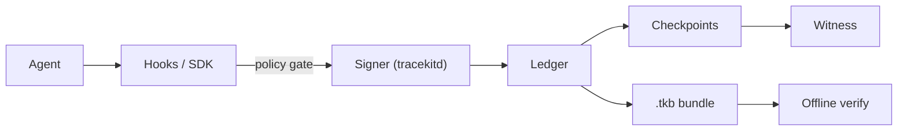

<div align="center">

# Tracekit

**Tamper-evident records of what your AI agents actually did.**

Every tool call is checked against your policy before it runs, then signed and hash-chained by a signer the agent
cannot control. Change, delete or reorder anything afterwards and verification fails.

[](https://github.com/Cygnux-Labs/Tracekit/actions/workflows/ci.yml)
[](https://pypi.org/project/tracekit-ai/)
[](https://github.com/Cygnux-Labs/Tracekit/blob/main/pyproject.toml)
[](https://github.com/Cygnux-Labs/Tracekit/blob/main/LICENSE)


</div>

## Why

Agents run commands, edit files and call APIs with your permissions. Afterwards, the record of what they did is usually
a log or a transcript the agent's own user can edit or delete, which makes it weak evidence. Tracekit writes that
record so it can be checked by anyone, offline, without trusting the agent or the machine it ran on:

- **Before an action:** the policy gate blocks it (`deny`), holds it for a human (`ask`) or marks it (`flag`).
- **As it happens:** a separate signer, which holds the key and assigns sequence numbers, signs every event into an
  append-only hash chain. The agent never holds the key.
- **Afterwards:** checkpoints go to a witness, and a `.tkb` bundle verifies offline. Edits, deletions, reordering and a
  quiet rebuild of the whole log are all detected.

## Quickstart

```bash
pip install tracekit-ai
tracekit demo               # exit 0
```

`tracekit demo` needs no API key, root or config. It runs a scripted agent that is told to upload `.env`, shows the
block, exports the run, verifies it, then edits one recorded command in a copy and shows verification fail.

Trace your own Claude Code sessions (dev mode: the signer runs as your user):

```bash
tracekit init --dev
tracekit observe            # the live view above, on http://127.0.0.1:7777
tracekit export --last -o run.tkb
tracekit verify run.tkb --key ~/.tracekit-signer/ledger/signer.pub --witness git:$HOME/.tracekit-signer/witness
```

Or check the shipped sample bundles with the verifier alone:

```bash
tracekit verify docs/sample/demo-run.tkb --key docs/sample/signer.pub            # exit 0
tracekit verify docs/sample/demo-run-tampered.tkb --key docs/sample/signer.pub   # exit 1
```

## What you get

| | |
|---|---|
| **Policy gate** | Versioned rules with stable ids (`TK-D006` uploading a secrets file, `TK-D003` force push, ...) decide before a tool runs. `ask` holds a call until a different OS user approves it. |
| **Signed hash chain** | Ed25519 signatures over a contiguous sequence, written by `tracekitd`. Lost events become signed `capture.gap` records, never silence. |
| **Witnesses** | Checkpoints of the chain head go to a git remote, a file or a witness service, so even the key holder cannot rebuild history unnoticed. |
| **Offline verification** | `tracekit verify` checks a bundle with no network and no Tracekit server, and prints what it proves and what it cannot. |
| **Live observer** | `tracekit observe`: agents, actions, blocks, alerts, a per-agent timeline and the evidence behind every row. |
| **Honest coverage** | The verifier names the blind spots a run touched (subprocess traffic, a same-user signer, an unbound harness) instead of a bare "OK". |

## How it works



- **Hooks and SDKs** run before and after each tool call (coding-agent hooks) or around the calls you wrap (Python and
  TypeScript SDKs). The policy decision is made, and signed, before the tool runs.
- **The signer** holds the key and assigns sequence numbers. In Linux system mode it runs as its own OS user, so the
  agent's user cannot read the key, change the ledger or modify the code that records it.
- **The ledger** is append-only JSONL: each record carries the previous record's hash and a signature over
  `(hash, prev_hash, seq)`.
- **Checkpoints** sign the chain head every few records, at every run end and on shutdown, and are published to
  witnesses outside the attacker's reach.
- **Bundles** hold a run's records, checkpoints and policy snapshots, and verify offline against a pinned key or a
  witness.

## What a verified bundle proves

`tracekit verify` ends with two lines; read them together.

- **Integrity:** the records are the ones the signer signed, with none edited, removed or reordered; the head is
  covered by a checkpoint; every policy decision is tied to the policy snapshot that made it. It is anchored only if
  you pass the signer's key (`--key`) or a witness (`--witness`).
- **Assurance:** who could have rewritten the ledger before it was checkpointed. `dev` means the signer ran as the
  agent's own user. System mode puts it under a separate OS user.

A verified bundle does **not** prove intent, complete coverage, or that a reported tool result is real. Anything the
agent does outside a capture path (inside a subprocess, after the last hook) is not seen; the verifier lists the blind
spots a run touched. Every claim is mapped in the
[threat model](https://github.com/Cygnux-Labs/Tracekit/blob/main/docs/threat-model-laptop.md).

## Supported today

| Capture path | Status | Docs |
|---|---|---|
| Claude Code hooks (and the Claude Code plugin) | supported | [plugin](https://github.com/Cygnux-Labs/Tracekit/blob/main/plugin/README.md) |
| Codex CLI, Cursor, Gemini CLI hooks | supported | [coding agents](https://github.com/Cygnux-Labs/Tracekit/blob/main/docs/coding-agents.md) |
| Python SDK (`tracekit_sdk.Tracer`; `tracekit.init()` records OpenAI, Anthropic and Gemini calls) | supported | [adapters](https://github.com/Cygnux-Labs/Tracekit/blob/main/docs/adapters.md), [examples](https://github.com/Cygnux-Labs/Tracekit/blob/main/examples/) |
| TypeScript SDK (`@cygnux/tracekit`) | supported | [sdk/typescript](https://github.com/Cygnux-Labs/Tracekit/blob/main/sdk/typescript/README.md) |
| LangChain / LangGraph, MCP client sessions | supported | [adapters](https://github.com/Cygnux-Labs/Tracekit/blob/main/docs/adapters.md) |
| OpenTelemetry receiver (`tracekit otel serve --experimental`) | experimental: records after the fact, gates nothing | [OpenTelemetry](https://github.com/Cygnux-Labs/Tracekit/blob/main/docs/otel.md) |

Linux runs dev mode and system mode; macOS runs dev mode and an experimental system mode; Windows runs dev mode only
([platforms](https://github.com/Cygnux-Labs/Tracekit/blob/main/docs/portability.md)). Separate packages under
`contrib/`: [proofpack](https://github.com/Cygnux-Labs/Tracekit/blob/main/contrib/proofpack/README.md) (auditor zip),
[query](https://github.com/Cygnux-Labs/Tracekit/blob/main/contrib/query/README.md) (SQL and MCP over the ledger),
[stagehand](https://github.com/Cygnux-Labs/Tracekit/blob/main/contrib/stagehand/README.md),
[causeway](https://github.com/Cygnux-Labs/Tracekit/blob/main/contrib/causeway/README.md),
[onchain](https://github.com/Cygnux-Labs/Tracekit/blob/main/contrib/onchain/README.md).

## System mode (Linux)

```bash
sudo /usr/bin/python3 -m tracekit init --user <agent-user> --witness git:/var/lib/tracekit/witness@git@github.com:you/tk-witness.git
tracekit status
```

Run init with a root-owned Python. It installs Tracekit into a root-owned virtualenv at `/opt/tracekit` (the same
`tracekit-ai` version from PyPI, or this repository from a root-owned clone), runs the signer as its own OS user, and
blocks tool calls while the signer is down (fail closed). `tracekit doctor` checks that nothing the agent can modify is
on that path. Register the agent CLI as the **harness** (`--harness`) and the signer accepts runs only from that
program's process tree.

## Policy and approvals

Rules live in [`tracekit/policy/default.yaml`](https://github.com/Cygnux-Labs/Tracekit/blob/main/tracekit/policy/default.yaml):
`deny` blocks the call, `ask` holds it until someone runs `tracekit approve` or `tracekit reject` (outside dev mode, a
different OS user), and `flag` lets it through and marks it.
[`strict.yaml`](https://github.com/Cygnux-Labs/Tracekit/blob/main/tracekit/policy/strict.yaml) fails closed and asks
before pushes, publishes and uploads. Rules are regex tripwires that a determined agent can evade; the guarantees come
from the signer, the chain and the witness.

## Use in CI

Verify a bundle in a GitHub Actions workflow:

```yaml
- uses: Cygnux-Labs/Tracekit@main
  with:
    bundle: run.tkb
    key: keys/signer.pub        # pin the signer; or witness: git:/path/to/clone
```

`require-anchor` defaults to `true`, so an unanchored bundle fails the step; set `require-anchor: "false"` to only
report it.

## CLI

`tracekit --help` lists every command. The common ones: `init`, `status`, `doctor`, `demo`, `observe`,
`pending` / `approve` / `reject`, `export`, `verify` (exit `0` ok, `1` fail, `2` unusable bundle, `3` warnings with
`--strict`), `analyze`, `uninstall`.

## Docs

[Threat model](https://github.com/Cygnux-Labs/Tracekit/blob/main/docs/threat-model-laptop.md) ·
[signing](https://github.com/Cygnux-Labs/Tracekit/blob/main/docs/signing.md) ·
[witnesses](https://github.com/Cygnux-Labs/Tracekit/blob/main/docs/witnesses.md) ·
[privacy](https://github.com/Cygnux-Labs/Tracekit/blob/main/docs/privacy.md) ·
[findings](https://github.com/Cygnux-Labs/Tracekit/blob/main/docs/findings.md) ·
[evaluation](https://github.com/Cygnux-Labs/Tracekit/blob/main/docs/evaluation.md) ·
[review packet](https://github.com/Cygnux-Labs/Tracekit/blob/main/docs/review-packet.md)

## v2 signer

The v2 signer (preview) serves agents over RPC, decides policy itself and writes evidence format v2:
[quickstart](https://github.com/Cygnux-Labs/Tracekit/blob/main/docs/quickstart-v2.md) ·
[format spec](https://github.com/Cygnux-Labs/Tracekit/blob/main/docs/format-v2.md) ·
[threat model](https://github.com/Cygnux-Labs/Tracekit/blob/main/docs/threat-model-server.md) ·
[reading a verify report](https://github.com/Cygnux-Labs/Tracekit/blob/main/docs/verdicts.md) ·
[auditor guide](https://github.com/Cygnux-Labs/Tracekit/blob/main/docs/auditor-guide.md) ·
[approvals](https://github.com/Cygnux-Labs/Tracekit/blob/main/docs/approvals.md) ·
[policy reference](https://github.com/Cygnux-Labs/Tracekit/blob/main/docs/policy-v2.md)

## Roadmap

Tracekit is being extended from laptop coding agents to server-hosted agents: a signer service that agents reach over
the network, evidence format v2 and policy enforced inside the signer. Existing v1 bundles keep verifying. To try the v2
signer, `pip install 'tracekit-ai[signer]'` and follow the
[v2 quickstart](https://github.com/Cygnux-Labs/Tracekit/blob/main/docs/quickstart-v2.md), or a framework quickstart
with a runnable offline example:
[LangChain / LangGraph](https://github.com/Cygnux-Labs/Tracekit/blob/main/docs/quickstarts/langchain.md),
[OpenAI Agents SDK](https://github.com/Cygnux-Labs/Tracekit/blob/main/docs/quickstarts/openai-agents.md),
[Claude Agent SDK](https://github.com/Cygnux-Labs/Tracekit/blob/main/docs/quickstarts/claude-agent-sdk.md),
[MCP client](https://github.com/Cygnux-Labs/Tracekit/blob/main/docs/quickstarts/mcp.md),
[custom agent](https://github.com/Cygnux-Labs/Tracekit/blob/main/docs/quickstarts/custom.md).
`tracekit demo --server` runs the whole v2 loop in a temp dir.

## Contributing and security

See [CONTRIBUTING.md](https://github.com/Cygnux-Labs/Tracekit/blob/main/CONTRIBUTING.md): `make install`, then
`make check` runs lint, tests and the build. Report vulnerabilities privately as described in
[SECURITY.md](https://github.com/Cygnux-Labs/Tracekit/blob/main/SECURITY.md).

## Licence

MIT, Copyright Cygnux Labs. See [LICENSE](https://github.com/Cygnux-Labs/Tracekit/blob/main/LICENSE).
