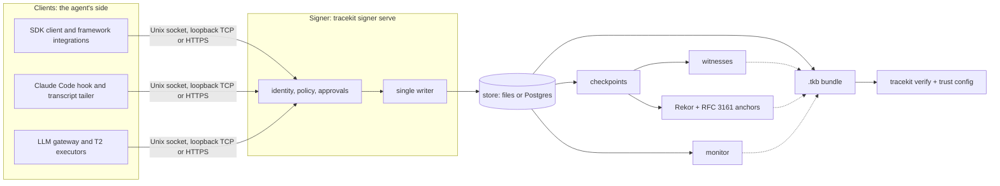

# Architecture

The v2 signer's components and how evidence flows through them. The byte-level format is in
[format v2](format-v2.md); what each component defends, and against whom, in the threat models
([laptop](threat-model-laptop.md), [server](threat-model-server.md)).

## Clients

Everything that reports to the signer, none of it trusted: the SDK client (`tracekit.sdk.client`) and the framework
integrations built on it (`tracekit/integrations/`, [quickstarts](quickstart-v2.md)), the Claude Code hook and the
transcript tailer (`tracekit.integrations.claude_code`, `tracekit.tailer`), and the out-of-process recorders: the
[LLM gateway](gateway.md) and T2 executors ([approvals](approvals.md#tiers-t1-and-t2-executors)). A client registers a run, asks the signer to `decide` each tool call
before it runs and reports it `complete` after. Clients hold a run token, never a signing key.

The tier of a record says where it came from: T1 in-process (hooks, adapters), T2 out-of-process (gateways,
executors), T3 imported telemetry ([OpenTelemetry](otel.md)).

## Signer

`tracekit signer serve` (`tracekit/signer/service.py`), one program in every [deployment mode](deploy.md).

- **Transport and identity** (`tracekit/transport/`, `tracekit/identity/`): a Unix socket with the peer's uid, loopback
  TCP with a token (Windows dev), or HTTPS with Kubernetes service-account tokens, mTLS (SPIFFE) or named tokens. The
  signer's config maps each identity to a tenant and the calls it may make; the isolation it records comes from the
  transport, never from the client.
- **Policy** (`tracekit/policy2/`): rules over the raw arguments, evaluated with the signer's own tool classes;
  `allow`, `deny` or `ask` ([policy reference](policy-v2.md)). An `ask` waits for an approval bound to the exact
  arguments, from an approver the config names ([approvals](approvals.md)).
- **Single writer** (`tracekit/signer/pipeline.py`): one thread assigns every sequence number and previous hash, signs
  the record and appends it in a batch. A refused or failed write leaves no state; outages, lost transcripts and
  witness failures become signed gaps.
- **Keys** (`tracekit/signer/logkey.py`, [signing](signing.md)): a stable log key signs checkpoints (a file key or AWS
  KMS); record keys can be short-lived and certified by the [issuer](issuer.md).

## Store and checkpoints

The store (`tracekit/storage/`: files with fsync, or Postgres) holds the records and their Merkle tree as tiles
(`tracekit/merkle/`). The signer periodically signs a checkpoint of the tree: a C2SP signed note of its size and root
(`tracekit/format/checkpoint.py`), optionally hybrid with SLH-DSA.

## Witnesses, anchors and the monitor

- **Witnesses** (`tracekit/tlog_witness.py`, [witnesses](witnesses.md)) cosign each checkpoint after checking it is
  consistent with the last one they saw, so a rewritten or forked log can't get a cosignature.
- **Anchors** (`tracekit/anchor/`): Rekor v2 entries and RFC 3161 timestamps of a checkpoint, for an outside time.
- **The monitor** (`tracekit monitor`, [monitor](monitor.md)) follows the log from outside and checks what witnesses
  can't (log and run chains, key records, that every run has its registry leaf, rollbacks and forks), and signs a
  report.

## Bundles and the verifier

`tracekit export --v2` (`tracekit/bundle_v2.py`) writes one run, or a tenant's run-set, as a `.tkb`: the records,
inclusion proofs into a checkpoint, its Rekor and timestamp anchors, and the policy snapshots that decided the calls. It holds no
verification code.

`tracekit verify` (`tracekit/verify/v2.py`) checks it offline against a **trust config** the verifier brings: the
pinned log keys, witnesses and their quorum, and optionally a monitor. Nothing in the bundle is trusted for that. The
report gives `Integrity` (are these the signed records) and `Assurance` (who vouches for the checkpoint)
([verdicts](verdicts.md), [auditor guide](auditor-guide.md)). v1 bundles go to the frozen v1 verifier
(`tracekit/verify/v1.py`).

## The v1 signer

The laptop signer `tracekitd` (`tracekit/daemon.py`, `tracekit/ledger.py`) and its hooks still ship: one JSONL hash
chain per machine, checkpointed to git or file witnesses, verified with `tracekit verify --key`. `tracekit signer
bridge` continues a v1 ledger into a v2 log ([migration](migration.md)).
