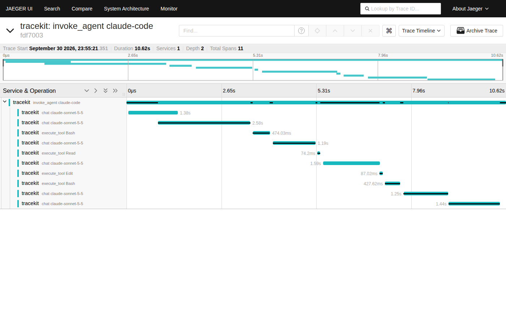

# OpenTelemetry

Tracekit speaks OpenTelemetry in both directions.

- **In:** `tracekit otel serve` receives OTLP/HTTP traces and records the agent-relevant spans as signed ledger events.
- **Out:** `tracekit export --otel` writes a bundle's events as OTLP/JSON spans, and `--otel-endpoint` sends them to a collector
  (Jaeger, Tempo, or anything that accepts OTLP).

## Receiving traces

> **Experimental.** The OTLP receiver (`tracekit otel serve`) and the ingest gateway (`tracekit ingest serve`) are off
> by default and being rebuilt: each runs only with `--experimental` and prints a warning when it starts.
> `tracekit init` never starts them.

```bash
tracekit init --dev                     # once: a local signer
tracekit otel serve --experimental      # http://127.0.0.1:4318/v1/traces
OTEL_EXPORTER_OTLP_TRACES_ENDPOINT=http://127.0.0.1:4318/v1/traces python my_agent.py
```

Any OTLP/HTTP exporter works: protobuf or JSON bodies, `gzip` or `deflate` encoding. For exporters that default to
gRPC, add `--grpc-port 4317` (needs `pip install "tracekit-ai[grpc]"`): the same receiver handles both, a signer outage is
answered with `UNAVAILABLE` (exporters retry) and a malformed request with `INVALID_ARGUMENT`. The receiver has no
dependencies of its own; it decodes protobuf itself. It listens on loopback only. Agents on other machines send to
the ingest gateway instead, which serves the same `/v1/traces` path behind TLS and per-client tokens:

```bash
tracekit ingest token build-box --home /var/lib/tracekit      # prints a token once
tracekit ingest serve --experimental --home /var/lib/tracekit --host 0.0.0.0 --cert c.pem --key k.pem
# on the agent's machine
OTEL_EXPORTER_OTLP_TRACES_ENDPOINT=https://tracekit.example:8443/v1/traces \
OTEL_EXPORTER_OTLP_TRACES_HEADERS="Authorization=Bearer%20tk_..." python my_agent.py
```

### What becomes evidence

| Span | Recognised by | Ledger events |
|---|---|---|
| Model call | `gen_ai.operation.name` = `chat`, `text_completion`, `generate_content`; OpenLLMetry `llm.request.type`; OpenInference `LLM` | `model.exchange` request + response: model, provider, finish reason, tool calls the model asked for, error, duration; prompt and output hashed (or clear with `content_capture: full`) |
| Tool execution | `execute_tool`; OpenLLMetry `traceloop.span.kind=tool`; OpenInference `TOOL` | `tool.call`, `policy.decision`, `tool.result` |
| Root span | no parent | `run.end` (`error: ...` when the span failed) |
| Anything else | HTTP, DB, framework internals | counted and skipped |

Each trace is one run, `otel:<service.name>:<trace_id>` (prefixed `remote:<client>:` through the gateway). A
`run.start` is written the first time a trace is seen, with the policy snapshot attached.

### What it means

- **Application-reported.** Events are recorded as `source=sdk`: the application said this happened. Nothing proves the
  spans are complete or true, and the coverage report lists OTel runs separately.
- **After the fact.** Spans are exported when the work is done, so policy is evaluated retrospectively and nothing is
  gated. A call that a `deny` or `ask` rule would have stopped is recorded as `flag`, with
  `policy would have returned deny before execution` in its reasons. To block calls before they run, use the hooks,
  the SDK's `tool()` or the LangChain adapter.
- **Same privacy rules.** Content is redacted and hashed exactly as for hooks and the SDK ([privacy](privacy.md)).
- **Not cross-checked as proxy evidence.** Model exchanges reported by the application are never used for the signer's
  hook/proxy cross-check, which would otherwise raise false `hook_missing` gaps.

### Delivery guarantees

- **Retries do not duplicate evidence.** Every (trace, span, event kind) is written at most once per receiver process.
- **Outages are retryable.** If the signer is down the receiver answers `503` with `Retry-After`, so the exporter keeps
  the batch. Events written before the outage are not written again on retry.
- **Rejections are partial successes.** An event the signer refuses is reported in the OTLP `partialSuccess`
  (`rejectedSpans`, `errorMessage`); the rest of the batch still lands.
- **Bounded input.** Bodies up to 4 MB (16 MB after decompression), 10,000 spans per request, attribute nesting capped
  at 16 levels. Malformed bodies get `400`, unknown content types `415`.

## Exporting traces

`tracekit export --otel` adds `otel.json` to the bundle. One trace per run: an `invoke_agent` root span, a `chat` span
per model exchange and an `execute_tool` span per tool call, with GenAI attributes where they exist and Tracekit's
security fields under `tracekit.*`. Every span carries `tracekit.seq` and `tracekit.entry_hash`, the hash of the signed
ledger entry it came from, so a span seen in any backend can be traced back to evidence that `tracekit verify` checks.

Runs that came in over OpenTelemetry go back out with their original trace id and span ids, so Tracekit can sit
between your instrumentation and your existing observability tool without breaking links.



### Example: a run in Jaeger, checked against the evidence

```bash
jaeger                                                    # Jaeger v2 all-in-one: OTLP on :4318, UI on :16686
python3 examples/custom_agent.py                          # any traced run
tracekit otel push --endpoint http://localhost:4318 --all # or --follow to send each run as it ends
tracekit export --out run.tkb
python3 examples/otel_jaeger_check.py run.tkb http://localhost:16686
```

Output from Jaeger 2.22 (Linux arm64, Python 3.10, October 2026):

```
tracekit verify exit: 0
  invoke_agent research-bot        seq    0  2a3338dd0563ecf2272ac33  in bundle
  execute_tool http_get            seq    5  efcdcb3bd72585435e8ad1b  in bundle
  execute_tool http_get            seq    8  0209316a33b36671ba4bea3  in bundle
  execute_tool parse_table         seq   12  8314fd52fa98e994a462ad7  in bundle
  execute_tool parse_table         seq   13  cd4aa931bcee3d36aa0e19c  in bundle
  execute_tool Agent               seq    2  85f0caa1a99156eea5a2660  in bundle
  execute_tool Agent               seq    4  e3f58f19031c95f5482ca3f  in bundle
  execute_tool Bash                seq   20  89c43138e53242bf20f7887  in bundle
8/8 spans resolve to a signed record in the verified bundle
```

The denied `sudo cp` shows up in Jaeger as an `execute_tool Bash` span with `tracekit.policy.decision=deny`. Jaeger is a
view: if a span and the bundle ever disagree, the bundle (checked by `tracekit verify`) is the record.

## The v2 signer

### Receiving traces (tier T3 import)

With an `otlp` section in `signer.yaml`, the signer's HTTPS listener also answers OTLP/HTTP `POST /v1/traces`
(protobuf or JSON, `gzip` or `deflate`). It is never unauthenticated: the same authenticators as the RPC (`k8s_sa`,
`mtls`, `token`) identify the caller before its body is read, and `authorize` must grant that identity `otlp_import`
(no identity has it by default). For local development, use a loopback listener with `insecure_loopback: true` and a
bearer token.

```yaml
http: {listen: 0.0.0.0:8443, cert: tls/server.pem, key: tls/server.key, authenticators: [mtls], client_ca: {...}}
otlp: {max_spans: 512}                       # spans per request, default 512
tenants: {"mtls:spiffe://acme/collector": acme}
authorize: {"mtls:spiffe://acme/collector": [otlp_import]}
```

- **One run per (tenant, trace id).** The caller's tenant comes from `tenants`, as for RPCs; the run id is
  `otel:<trace id>`, never derived from `service.name`, so two services in one trace share a run and one service's two
  traces are two runs. The signer registers it (`run.registered`, `source: import`, `tier: T3`, `fidelity: none`).
- **Records.** A tool span becomes `tool.call` + `tool.result`, a model span one `model.exchange`, all `source: import`,
  `tier: T3`, with the span id in `span_id`. Arguments, results and messages are redacted and kept only as commitments
  (`hmac-sha256:`), as for the RPC. Other spans are counted and skipped. Imported runs are not reconciled.
- **Meaning.** T3 proves receipt at the time of the record, nothing about completeness or truth; nothing is gated.
- **Retries write nothing twice.** A (span id, record type) is written once per run, and the set is part of the run's
  state, so it survives restarts and snapshots: a re-sent batch writes nothing, and no second `run.registered` appears.
- **Lifecycle.** An imported run closes like any other: after `idle_s` without spans, `run.closing{idle_timeout}`, then
  `run.final`. Spans for a final run are rejected (`partialSuccess`).
- **Refusals.** No accepted credential: `401`; no `otlp_import`: `403`; a malformed body (nested too deep, a protobuf array or
  attribute list over 512 entries, or any decoding error): `400`, with nothing written. A request is written whole or
  not at all. The identity's event rate and open-run quotas apply (`503` with `Retry-After`, so exporters retry).

### Exporting spans

`tracekit export --v2 --run RUN --otel` writes the run's spans next to the bundle as `<name>.otel.json`
(`--otel-endpoint` also sends them). With `otel_out: {endpoint, headers}` in `signer.yaml`, the signer sends each run
when it reaches `run.final`, from its own thread with a queue of 1000 runs; runs it could not deliver are counted in
`tracekit_signer_otel_export_dropped_total` ([observability](observability.md)).

One trace per run: an `invoke_agent` root span and an `execute_tool` span per call (tool call id and attempt). Every span
carries `tracekit.entry_hash` (the hash of its first signed record), `tracekit.run_seq` and `tracekit.tier`; tool spans
add `tracekit.policy.decision`, `tracekit.policy.rule_ids`, `tracekit.args_commitment` and `tracekit.result.hash`.
Argument and result content is never exported: v2 records hold commitments only. An imported run keeps its trace id and
its tool spans their span ids.
