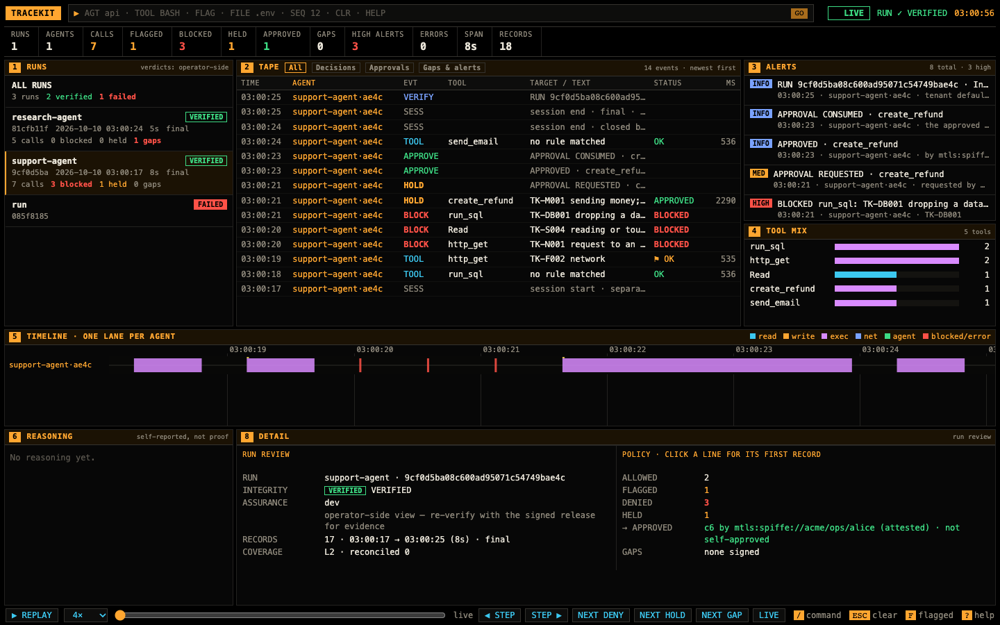

# Viewer

## Laptop viewer



`tracekit view [--dev | --config signer.yaml | --data-dir DIR]` reads one signer's store, read-only, and verifies each
run with the code `tracekit verify` runs. The page is the observer's terminal, for runs:

- **Runs** (panel 1): each run with its agent's registered name, the verifier's verdict (`VERIFIED`, `FAILED`, or
  `PENDING` until a checkpoint covers the run's last record; every verdict is operator-side, see below), start time,
  duration, and its calls, blocked, held and gaps. Clicking a run scopes the tape, timeline, tool mix and header to it;
  **All runs** restores the full view. A run that fails shows only its verifier report.
- **Tape** filters: All, Decisions, Approvals, Gaps & alerts. Holds and approvals are their own rows (`HOLD`,
  `APPROVE`, `REJECT`) in words: who asked, which rules, who answered (attested, or vouched for by a bridge), the
  reason, self-approval and break-glass. The signer's own records (`signer.epoch`, `refusal.summary`, key records) are
  the `signer`'s rows, not an agent's.
- **Detail**: a call's decision, its rules with their reasons, its arguments commitment and approval binding, and the
  verdict of its run. v2 records keep a call's arguments only as a salted commitment, so the viewer shows the rules'
  reasons instead (from the policy whose hash the decision records: a shipped pack or the config's `policy`; other
  policies show rule ids only); `tracekit signer reveal --record <seq>` gives an auditor the salt.
- **Run review** (detail, with a run selected and no row): Integrity and Assurance, allowed / flagged / denied / held
  and who approved, gaps by kind, coverage. Each line opens its first record.
- **Replay** (with a run selected): `SPACE` plays or pauses, `←` `→` step one record, `D` `H` `G` jump to the next deny,
  hold or gap, `L` or `ESC` returns to live. The header and tape show the run as of the playhead; the timeline marks
  it.

The timeline is scaled to the calls shown, not the clock. The page and server are the observer's, with its
checklist ([security-checklist.md](security-checklist.md)).

## Central viewer

`tracekit view` with a `view.logs` section reads every log of a central deployment
([deploy-kubernetes.md](deploy-kubernetes.md)) and serves its runs to auditors, approvers and operators, read-only.

```yaml
data_dir: /tmp                        # the viewer's own; never a signer's
view:
  logs: [log-0.dsn, log-1.dsn]        # one DSN file per log (its schema), for a role holding READ_GRANTS only
  oidc: {issuer: corp, client_id: tracekit-viewer, redirect_uri: https://view.corp.example/callback,
         roles: {auditor: ["group:corp/auditors"], approver: ["group:corp/approvers"],
                 operator-admin: ["group:corp/sre"]}}
```

```bash
tracekit view --config viewer.yaml --host 0.0.0.0 --tls-cert tls.crt --tls-key tls.key
```

Each DSN's role holds `tracekit.storage.postgres.READ_GRANTS` (SELECT only), so the viewer can't write a log even by
mistake. Each log's verdicts pin the log vkey that log's store holds (or `--log-vkey`, for every log).

### Who sees what

| Session | Runs | Approvals |
|---|---|---|
| auditor (OIDC, the issuer's tenant claim) | its tenant's, read-only | none |
| approver (OIDC, the tenant claim) | its tenant's, read-only | its tenant's, with `view.signer` ([approvals.md](approvals.md#web-approvals-and-passkeys)) |
| operator-admin (OIDC) | every tenant's, read-only | none |
| the printed token | every tenant's, read-only | none |

The tenant is enforced in every query the viewer makes (a `tenant = …` condition taken from an auditor's or approver's
session, never from the request), not only on the page: a session of tenant A gets no run of tenant B from a list, a
search, a run's page or a bundle download, even with B's run id. Its only write path is the approval pages.

### Pages and API

`/runs` lists the runs, log by log, newest first, and searches them. Every request is a `GET`:

| Path | Answers |
|---|---|
| `/api/runs?run&agent&tenant&since&until&verdict&gaps&denies&approvals&limit&after` | `{runs, next}`: at most `limit` (50) runs, each with its log, tenant, agent, first and last event time, record count, gaps, denies, approvals and verdict; `next` is the `after` of the next page. `since`/`until` are RFC 3339 UTC times; `verdict` is `verified`, `failed` or `pending`; `gaps=1`, `denies=1` and `approvals=1` keep runs that have one; `tenant` narrows an operator-admin's list. One search query per log per page, plus a reader of each log with matching runs (it reads that log's index). |
| `/api/run?log&tenant&run&from` | the run's verdict with verify.v2's full report and, only when it verified, 500 of its records from the `from`th, with `next` |
| `/api/bundle?log&tenant&run` | the run's `.tkb` bundle |

A run's verdict is what `tracekit verify` gives the bundle the viewer exports from the store; a run whose last record no
checkpoint covers yet is `pending`, and a run that fails shows its failure report and none of its records. Every verdict
carries the label **"operator-side view — re-verify with the signed release for evidence"**: the viewer runs on the
operator's side, so its verdict is not evidence. An auditor downloads the bundle and checks it with `tracekit verify`
from the signed release, against keys and witnesses they pinned themselves ([auditor-guide.md](auditor-guide.md)).

The page and API pass the browser surface's checklist ([security-checklist.md](security-checklist.md)): strict CSP
with a fresh nonce, every value shown as text, `HttpOnly; SameSite=Strict` session cookies, and HTTPS off loopback.
